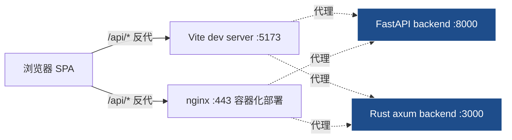

# 架构

> **目标读者**：所有人速查
> **核心价值**：5 个非显然架构决策的一站式入口
> **最后更新**：2026-08-26 · **维护者**：@frontend-team

---

本目录收录 myERP 前端的架构决策文档，每篇对应一个"看起来简单、但偏离常规做法"的非显然设计。新人 onboarding、Agent 接手新模块、后端联调对接前，都建议先扫一遍本索引。

## 整体架构图

dev 模式下 `vite.config.ts` 把 `/api` 转发到 `127.0.0.1:8000`；prod 模式下 nginx 反代到 docker-compose 内 `backend` 服务。前端代码里的 `baseURL` 是相对路径 `/api/v1` 或 `/api/v2`，由 nginx / vite 决定落到哪个后端。

## 五大决策索引

1. **双 axios 实例 + 信封协议**——`api` (v1) 与 `apiV2` (v2) 共享拦截器，所有响应被解 `{code, message, data}` 信封，非 0 抛 `ApiError`；auth 域 2026-08-26 临时回滚 v1，业务域（deliveryNote / deliveryGroup / parts/scanInspect）仍在 `apiV2`。
   → [api-contract.md](./api-contract.md)

2. **模块级 composable 单例**——装了 pinia 但实际状态全部在 composables 的 module-level ref 里（`useAuthSession` / `useScanSession` / `useBarcodeScanner`），新功能共享状态沿用此模式。
   → [state-management.md](./state-management.md)

3. **三道路由守卫 + menuCode 单一权限源**——`requireAuth` / `allowRoles` / `menuCode` 三道检查；菜单渲染与路由守卫共用后端下发的菜单树。
   → [routing-and-permissions.md](./routing-and-permissions.md)

4. **EP 按需加载 + CSS 变量主题**——`unplugin-auto-import` + `ElementPlusResolver` 按需注入；主题色走 `:root` 覆盖 `--el-color-primary*`（不走 `theme` prop，EP 2.14.x 尚未支持）。
   → [build-and-tooling.md](./build-and-tooling.md)

5. **pdfjs 单点配置 + worker 缓存穿透**——所有 PDF 渲染统一从 `src/utils/pdfjs.ts` import `pdfjsLib`，workerSrc 带缓存穿透版本串。
   → [pdf-integration.md](./pdf-integration.md)

## 阅读建议

- 接新模块前先读 1 和 3（API + 权限）。
- 排查"消息框样式丢了 / 主题色不生效"看 4。
- 排查"刷新页面后 PDF worker 不加载 / nginx .mjs MIME 错"看 5。
- 任何"组件之间怎么共享状态"的设计讨论先看 2。