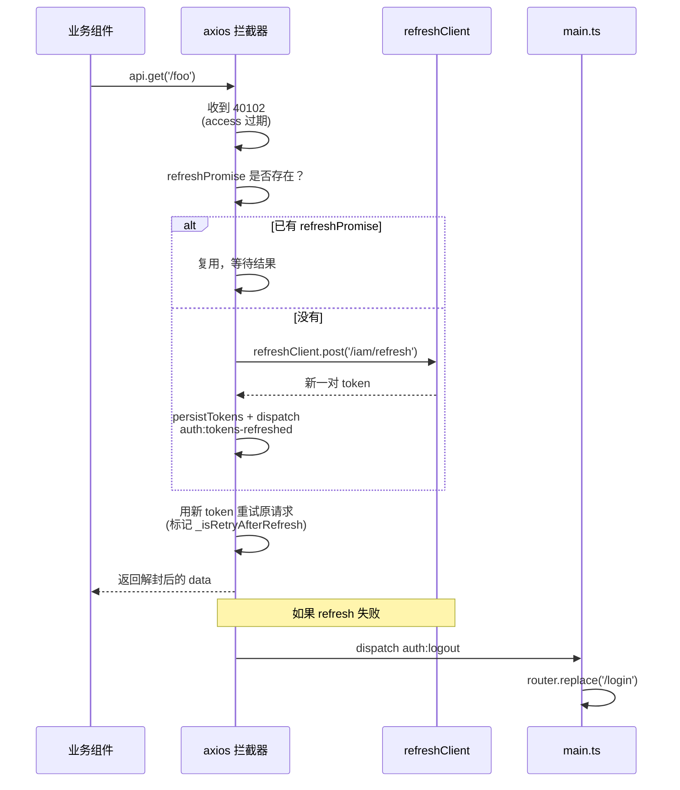

# API 契约：axios 封装、信封协议、自动 refresh

> **目标读者**：后端联调 / 新增接口的 Agent / 排查 401 异常链路的同学
> **核心价值**：把 axios 封装、信封协议、错误码、自动 refresh 链路完整讲清楚，避免误用 `api` / `apiPrint` / refresh client
> **最后更新**：2026-09-15 · **维护者**：@frontend-team

---

`src/api/http.ts` 把 axios 封装成统一的 HTTP 客户端，承担四件事：baseURL 路由、token 注入、信封解封、自动 refresh。本篇把这一层契约完整讲清楚。

## 三个 axios 实例

| 实例            | baseURL   | 拦截器 | 何时用                                                                                                                                                                                                       |
| --------------- | --------- | ------ | ------------------------------------------------------------------------------------------------------------------------------------------------------------------------------------------------------------ |
| `api`           | `/api/v2` | 有     | v2 Rust 后端**业务**接口（默认客户端）。所有 18 个 api 文件 + 业务 composable 走它。2026-09-15 Phase 5 起，`api` 直接以 v2 为默认；原 `apiV2` 已合并删除。                                                   |
| `apiPrint`      | `/api/v1` | 有     | v1 Python FastAPI 上**仅 4 个打印端点**专供客户端（与 `api` 共享同一组拦截器与 `refreshPromise` 单例）：`printNote` / `printNoteLabels` / `printPartDrawing` / `printPartDrawingBatch`。其它业务端点不走它。 |
| `refreshClient` | `/api/v2` | 无     | 仅 `/api/v2/iam/refresh`（v2 iam 域，baseURL 与业务 `api` 同版本）。                                                                                                                                         |

**反例**：`api.post('/v2/...')` 会被 baseURL 拼成 `/api/v2/v2/...`，404 静默失败。**单端点 v2 调用必须 `api.post('/...')`**，路径不带 `/v2` 前缀。打印端点必须 `apiPrint.post(...)`，不要走 `api`（baseURL 不一致）。

### refresh 客户端为什么独立

`refreshClient` 没有挂任何拦截器。原因：响应拦截器里有"40102 → 自动 refresh → 重试原请求"链路。如果 `/iam/refresh` 也走 `api`，refresh 自身失败抛 `ApiError` 40102，又会进拦截器再触发 refresh，无限递归。refresh 必须走裸实例隔离。

### refresh 客户端必须与主客户端同版本

切换 v2 时必须保证：**业务走 `api` 则 refresh 走 `refreshClient`**。两实例 baseURL 都是 `/api/v2`，refresh 端点落在 v2，原请求重试时也走 v2，token 一致。打印 `apiPrint` 与 `api` 共享 `refreshPromise`，并发撞 40102 只触发一次 `/iam/refresh`——同 token / 同 user，refresh 共享无副作用。

### 打印客户端为什么不并入 `api`

v1 Python 仍维护这 4 个打印端点；后续若打印也迁 v2 再统一并入 `api`。当前保留独立 `apiPrint` 的另一个理由：baseURL 物理隔离，方便排查「某个请求究竟打的 v1 还是 v2」的诊断问题。

## 信封协议 `{code, message, data}`

所有后端响应统一包成 `{code: number, message: string, data: T}`。拦截器看到 `code === 0` 时把 `response.data` 直接替换成裸 `data`，调用方拿到的就是 `T`。`code !== 0` 抛 `ApiError(code, message)`，调用方用 `try/catch + (e as ApiError).code` 判断业务错误码。

```ts
// 调用方代码形态
try {
  const data = await api.get<MyData>('/some/endpoint')
  // data 已经是裸 MyData，不是 {code, message, data}
} catch (e) {
  if ((e as ApiError).code === 42xxx) {
    // 业务错误码分支
  }
}
```

非标准响应（文件 blob / 文本 / 第三方回调）不经解封，原样透传。

### code 编号约定

| 区间            | 语义            | 备注                        |
| --------------- | --------------- | --------------------------- |
| `0`             | 成功            | 拦截器解封                  |
| `40101`–`40105` | 鉴权错误        | 见下表，拦截器有特殊处理    |
| `2xxxx`         | 业务错误        | 由调用方按 code 分支处理    |
| `4xxxx`         | 系统 / 校验错误 | 通常 5xx 对应 server 端异常 |

## 认证错误码表

| code  | 常量                       | 拦截器行为                                                                                                           |
| ----- | -------------------------- | -------------------------------------------------------------------------------------------------------------------- |
| 40101 | `BIZ_AUTH_INVALID`         | 抛错，调用方兜底（通常是路由守卫的 `refreshOrLogout`）                                                               |
| 40102 | `TOKEN_EXPIRED`            | 自动 refresh + 重试原请求（`refreshPromise` 单例防雪崩）                                                             |
| 40103 | `BIZ_AUTH_REFRESH_INVALID` | dispatch `auth:logout`，跳登录                                                                                       |
| 40104 | `OLD_PASSWORD_MISMATCH`    | 抛错，改密 dialog 提示用户                                                                                           |
| 40105 | `SESSION_REVOKED`          | dispatch `auth:logout`（**不走 refresh**：JWT 签名仍有效但 Redis `session:tok:<sha256>` 已被吊销，refresh 也救不回） |

`ApiError` 类暴露 `isAuthError` getter：40101 / 40102 / 40103 / 40105 都返回 true，调用方可一次性判断"是不是 session 出问题了"。

## 40102 自动 refresh 时序



并发撞 40102 时只触发一次 `/iam/refresh`：模块级 `refreshPromise` 单例，第一个请求触发后写入 promise，后续 40102 复用同一个；完成后用 `setTimeout(..., 0)` 让微任务队列里的消费者先看到结果再清空。

## Proactive refresh

每次成功响应都看一眼 access token 的 `exp`（JWT decode），剩余寿命 < 5 分钟就 fire-and-forget 触发 refresh。30 秒节流，避免短时间连续刷新。

实现关键点：

- `cachedAccessExp` 模块级缓存，避免每次都 decode JWT。
- 失败完全静默（`void getOrCreateRefresh().catch(() => {})`）——reactive 路径（用户触发的新请求收到 40102）会兜底。
- 40102 reactive refresh 已经把新 token 写回 localStorage 并 dispatch `auth:tokens-refreshed`；`useAuthSession` 监听该事件同步 module-level refs，组件下次 `useAuthSession().token.value` 拿到新值。

## query 序列化

`http.ts` 保留两份 serializer（2026-09-15 Phase 5 合并 v2 → 2026-09-15 hotfix 还原）：

| 函数                | 行为                                                            | 适用客户端                                                                       |
| ------------------- | --------------------------------------------------------------- | -------------------------------------------------------------------------------- |
| `serializeParamsV1` | **所有数组都重复 key**：`?key=a&key=b`（无 `[]` 后缀）          | `apiPrint`（baseURL `/api/v1`，FastAPI 期望重复 key）                            |
| `serializeParamsV2` | 白名单 key（`statuses` 等）→ CSV 单值 `?statuses=A,B`；其它重复 | `api` / `refreshClient`（baseURL `/api/v2`，Rust axum `Vec<T>` 默认按 `,` 分隔） |

`serializeParams` 保留为 `serializeParamsV1` 的向后兼容别名（历史代码可能仍在引用；新代码应直接选 `V1` / `V2`）。

```ts
// v1 FastAPI 期望：所有数组重复 key
apiPrint.post('/delivery-notes/{id}/print', { custom_order: [...] });
// → POST /api/v1/delivery-notes/{id}/print?custom_order=a&custom_order=b

// v2 业务期望：白名单 key 走 CSV 单值（注意 `,` 经 percent-encoding 为 `%2C`）；其它数组走重复 key
// 2026-09-17 PR-4 同步：CSV 白名单扩为 `statuses` / `locations` / `holder_ids`
// （与 backend-rust PartListQuery `Option<String>` 逗号解析对齐）
api.get('/delivery-notes', { params: { statuses: ['DRAFT', 'SHIPPED'] } });
// → GET /api/v2/delivery-notes?statuses=DRAFT%2CSHIPPED
api.get('/parts', { params: { locations: ['PRODUCTION_SHELF', 'WORKER'] } });
// → GET /api/v2/parts?locations=PRODUCTION_SHELF%2CWORKER
api.get('/parts', { params: { holder_ids: ['1700000000000000001', '1700000000000000002'] } });
// → GET /api/v2/parts?holder_ids=1700000000000000001%2C1700000000000000002
api.get('/delivery-notes', { params: { ids: ['1', '2'] } });
// → GET /api/v2/delivery-notes?ids=1&ids=2（非白名单 key 走重复 key）
```

### CSV 白名单（2026-09-17 PR-4 同步）

`ARRAY_AS_CSV_KEYS` 白名单（`src/api/http.ts`）：

| key          | 后端 schema                             | 加白名单日期    | 备注                                                                                                                  |
| ------------ | --------------------------------------- | --------------- | --------------------------------------------------------------------------------------------------------------------- |
| `statuses`   | `Option<String>` CSV → service Vec      | 2026-08-29 拆分 | Phase 5 误合并后 2026-09-15 hotfix 还原                                                                               |
| `locations`  | `Option<String>` CSV → service Vec      | 2026-09-17 PR-4 | `PartListQuery` 同步：t_part_batch.location 大类（OFFICE / PRODUCTION_SHELF / WORKER / ...）                          |
| `holder_ids` | `Option<String>` CSV → service Vec<i64> | 2026-09-17 PR-4 | `PartListQuery` 同步：t_part_batch.current_holder_id 多态 holder（t_shelf / t_worker / t_outsource_company 任一命中） |

未列入白名单的数组字段一律走重复 key（v1 兼容 + v2 部分端点未声明 schema）；前端发送前用 `cleanParams` strip 空数组（空数组 = 不发）。

### 历史拆分记录（2026-08-29 → 2026-09-15 Phase 5 → 2026-09-15 hotfix）

拆分前曾有 v1/v2 两份 serializer：

- `serializeParamsV1`：数组走重复 key（FastAPI `List[Enum] = Query(None)` 期望）
- `serializeParamsV2`：白名单 `statuses` → CSV 单值（Rust axum `Option<String>` 期望）

拆分原因：v1 业务与 v2 业务并存期间，CSV 单值行为泄漏到 v1 客户端 → `parts` 列表 / 外协报价列表点状态列筛选时，前端发 `?statuses=A,B`，Python FastAPI 期望重复 key 形式 `?statuses=A&statuses=B`，收到 CSV 后解析成单元素列表 `["A,B"]` → `OrderStatus("A,B")` 枚举校验失败 **422**。

2026-09-15 Phase 5 误合并：`apiV2` / `refreshClientV2` 合并进 `api` / `refreshClient` 时，`serializeParamsV2` 一并删除，统一用 `serializeParamsV1`（数组重复 key）。**误判**：v2 axum `Query<Vec<T>>` 默认按 `,` 分隔，重复 key `?statuses=A&statuses=B` 实际会失败（axum 反序列化器对重复 key 的处理依赖实现，常见情形是取最后 / 报错），引入 regression。

2026-09-15 hotfix 还原：恢复 2026-08-29 的 CSV 白名单拆分——`api` / `refreshClient` 绑 `serializeParamsV2`（白名单 `statuses` 等数组 → CSV 单值），`apiPrint` 维持 `serializeParamsV1`（FastAPI 期望重复 key）。`serializeParamsV2` 保留。

2026-09-17 PR-4 同步：白名单扩为 `statuses` / `locations` / `holder_ids`（与 backend-rust `PartListQuery` 三个 `Option<String>` 字段对齐），保证前端 `?locations=A%2CB&holder_ids=X%2CY` 能被 axum `Query<String>` 反序列化器正确解析（重复 key 形式会失败）。

回归守卫在 `src/api/http.spec.ts` 落地——`serializeParamsV1` / `serializeParamsV2` 各覆盖一组用例；`usePartsListQuery.locationsHolderIds.spec.ts` 加 F3 wire-format 断言验证完整 URL 形态。

## `cleanParams()`

`cleanParams(obj)` 去掉 `undefined` / `null` / 空字符串 `''` / 空数组 `[]` 的字段，保留数字 `0` 和布尔 `false`。给 list 类接口（GET `/xxx?a=1`）用——后端对 `''` 会做 `LIKE '%%'`（导致全量匹配），axios 默认只 strip `undefined` / `null`。2026-08-25 refactor 把 9 个 list API 的清洗逻辑收到 `http.ts` 这一层。

```ts
api.get('/parts', { params: cleanParams({ name: '', status: 'A', page: 0 }) });
// → GET /api/v2/parts?status=A&page=0
```

## localStorage 键 `auth_session`

```ts
interface StoredSession {
  token: string; // access JWT
  refresh_token: string; // 7d TTL refresh JWT（2026-07-10 新增）
  user: CurrentUser; // 含 menus / roles / shelf_ids
}
```

`localStorage['auth_session'] = JSON.stringify(stored)`。请求拦截器从这里读 token 挂 `Authorization: Bearer <token>`。`useAuthSession` 监听 `auth:tokens-refreshed` 事件同步 module-level refs，避免组件 re-render 拿到旧值。

## session 失效统一出口

refresh 失败 / 40101 / 40103 / 40105 都不直接调 vue-router，而是 `window.dispatchEvent(new CustomEvent('auth:logout'))`。`main.ts` 监听该事件后 `router.replace('/login')`。

```ts
// main.ts（拦截器反向依赖的解耦点）
window.addEventListener('auth:logout', () => {
  router.replace('/login');
});
```

为什么不直接在拦截器 `import router`：会形成循环依赖（router 引 store / composable，composable 引 http，http 又引 router），且不便单测。CustomEvent 是最低耦合的桥。

## 雪花 ID 全程 string

后端 ID 是雪花 ID（19 位），超过 `Number.MAX_SAFE_INTEGER`（2^53）。前端必须当 string 处理：

```ts
// 错误（丢精度）
const id = Number(parts[0].id);
// Number("198362487928651776") → 198362487928651780（实测差 4）

// 正确
const id = parts[0].id; // string
```

后端 Pydantic v2 默认 lax 模式会从 JSON string 自动 coerce 到 int，所以前端发请求时 `"id": "198362487928651776"`（字符串）和 `"id": 198362487928651776`（数字）后端都能正确解析。`useAuthSession.activeShelfId()` 返回 `string | null` 也是出于同一原因。

## 业务 / 打印客户端使用规约

| 客户端          | 业务域      | 4 打印端点 |
| --------------- | ----------- | ---------- |
| `api` (v2)      | ✅ 所有业务 | ❌         |
| `apiPrint` (v1) | ❌          | ✅         |

迁移检查清单（与 v2 时期一致，本节保留作 reminder）：

- 新增业务端点 → `src/api/<domain>.ts` 里 `import { api } from '@/api/http'`，路径不带 `/v2` 前缀。
- 新增打印端点 → `import { apiPrint }`，与 `api` 共享拦截器与 `refreshPromise`，不要混用。
- 不要 `api.post('/v2/...')`——会被 baseURL 拼成 `/api/v2/v2/...`。
- 后端契约变更 → 更新 `~/Code/hsh-erp-rust/docs/api/<domain>.md`（不要去翻源码反推）。

## 排错速查

| 现象                                                | 可能原因                                                                                                               |
| --------------------------------------------------- | ---------------------------------------------------------------------------------------------------------------------- |
| 请求 404，路径看着对                                | `baseURL` 错了（用了 `api` 但端点还走 v1 / 反之）                                                                      |
| refresh 后还是 40102                                | refresh 客户端与主客户端版本不一致（已统一为 v2）                                                                      |
| 收到响应但 `data` 是 `{code, message, data}` 没解封 | 后端没按信封协议返回（或者是非 JSON 文件 blob）                                                                        |
| `pdf` 上传后端报 500                                | 走 v1 上传但后端已切 v2，body 字段不兼容                                                                               |
| 列表接口（状态列筛选）返回 422                      | 走 v1 但前端发了 CSV 形式 `?statuses=A,B`（共享 `serializeParams` 时代残留），Python `List[Enum]` 解析成单元素列表失败 |
| 40105 频繁出现                                      | 改密 / 多设备登录 / 管理员停用了账号，导致当前 Redis session 被吊销                                                    |
| WebSocket 收不到推送                                | WS URL 错了（旧 `/api/v1/ws/dashboard` → 新 `/ws/dashboard`）                                                          |
