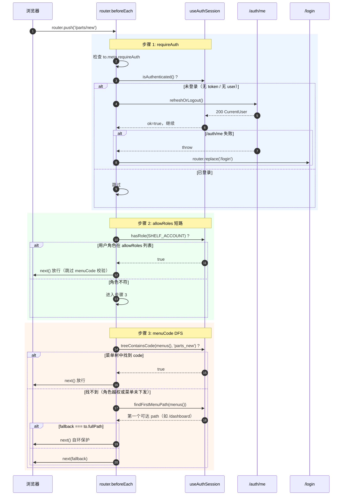
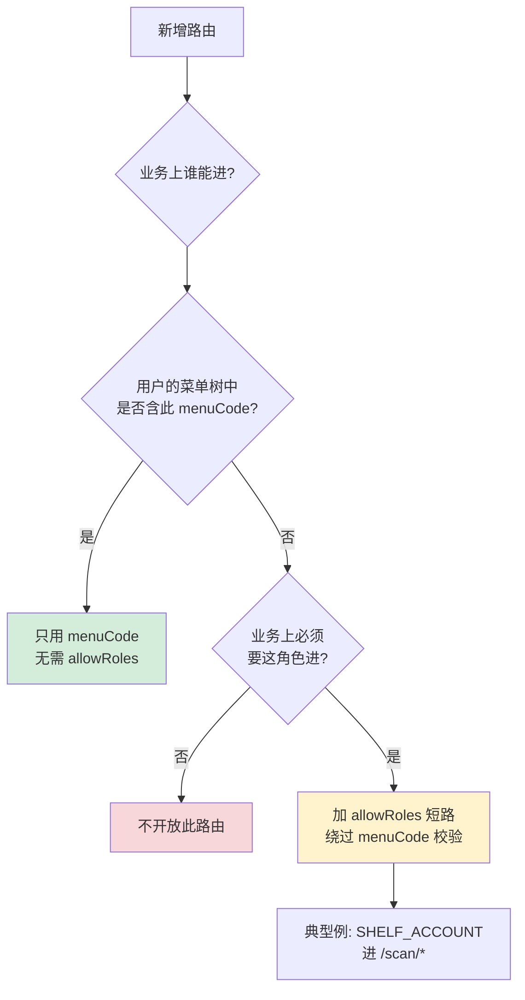

# 路由与权限

> **目标读者**：Agent 新增页面、后端联调对接菜单、排查"为什么我看不到这个页面"
> **核心价值**：路由表 + 三道守卫时序 + menuCode 单一权限源 + 新增页面 checklist
> **最后更新**：2026-08-26 · **维护者**：@frontend-team

---

路由表是整个前端的骨架。`src/router/index.ts`（约 380 行）定义所有路径，三道 `beforeEach` 守卫按顺序执行 `requireAuth` → `allowRoles` 短路 → `menuCode` DFS 校验。**菜单渲染（`MainLayout` 侧栏）和路由守卫共用同一份后端下发的菜单树**——单一权限源就是 `user.menus[i].code`。

## 路由总表

| path | name | component | menuCode | meta.requireAuth | 备注 |
|---|---|---|---|---|---|
| `/login` | Login | `views/auth/Login.vue` | — | false | 全屏独立路由，不在 MainLayout 内 |
| `/dashboard` | Dashboard | `views/Dashboard.vue` | `home` | true | 默认重定向目标 |
| `/parts` | PartsList | `views/parts/PartsList.vue` | `parts_list` | true | 订单管理根 |
| `/parts/new` | PartsNew | `views/parts/PartBatchNew.vue` | `parts_new` | true | 批量新建 |
| `/parts/:id` | PartsDetail | `views/parts/PartDetail.vue` | — | true | 复用父级 `parts_list` 权限（matched 链） |
| `/inspection/pending` | InspectionPending | `views/inspection/InspectionPending.vue` | `inspection_pending` | true | 待品检一览 |
| `/repair/receive` | RepairReceive | `views/repair/RepairReceive.vue` | `repair_receive` | true | 返修接收 |
| `/cnc/pending` | PendingProgramming | `views/cnc/PendingProgrammingList.vue` | `pending_programming` | true | CNC 编程员专属 |
| `/outsource` | — | redirect | — | — | → `/outsource/companies` |
| `/outsource/companies` | OutsourceCompaniesList | `views/outsource/OutsourceList.vue` | `outsource_companies_list` | true | 外协厂一览 |
| `/outsource/quotes` | OutsourceQuoteList | `views/outsource/OutsourceQuoteList.vue` | `outsource_quotes_list` | true | 报价一览 |
| `/outsource/send-receive` | OutsourceSendReceive | `views/outsource/OutsourceSendReceive.vue` | `outsource_send_receive_list` | true | 外协发送/接收 |
| `/outsource/send` | — | redirect | — | — | → `/outsource/send-receive?tab=sendable` |
| `/outsource/receive` | — | redirect | — | — | → `/outsource/send-receive?tab=receiving` |
| `/outsource/companies/:id/sent-parts` | OutsourceCompanySentParts | `views/outsource/OutsourceCompanySentParts.vue` | `outsource_companies_list` | true | 外协对账（不独立成菜单） |
| `/assemblies` | — | redirect | — | — | → `/parts`（2026-07-30 合并） |
| `/delivery-notes` | DeliveryNoteList | `views/delivery/DeliveryNoteList.vue` | `delivery_notes_manage` | true | 送货单 |
| `/delivery-notes/:id` | DeliveryNoteDetail | `views/delivery/DeliveryNoteDetail.vue` | `delivery_notes_manage` | true | 详情（共用 list 权限） |
| `/delivery-notes/scan` | DeliveryNoteScan | `views/delivery/DeliveryNoteScan.vue` | `delivery_notes_manage` | true | 扫码建单（不独立成菜单） |
| `/assemblies/:id` | AssemblyDetail | `views/assemblies/AssemblyDetail.vue` | — | true | 详情 |
| `/workers` | WorkerList | `views/WorkerList.vue` | `workers_list` | true | 工人一览 |
| `/users` | UserList | `views/users/UserList.vue` | `users_list` | true | 账号管理 |
| `/shelves` | ShelfList | `views/shelves/ShelfList.vue` | `shelves_list` | true | 货架管理 |
| `/statistics` | ProductionStats | `views/statistics/ProductionStats.vue` | `production_stats` | true | 生产统计 |
| `/customers` | CustomerList | `views/customers/CustomerList.vue` | `customers_list` | true | 客户一览 |
| `/applicants` | ApplicantList | `views/applicants/ApplicantList.vue` | `applicants_list` | true | 申请人一览 |
| `/settings/work-types` | WorkTypeList | `views/settings/WorkTypeList.vue` | `work_types_list` | true | 工种管理 |
| `/settings/processes` | ProcessList | `views/settings/ProcessList.vue` | `processes_list` | true | 工序管理 |
| `/settings/work-type-processes` | WorkTypeProcess | `views/settings/WorkTypeProcess.vue` | `work_type_processes_list` | true | 工种-工序映射 |
| `/scan` | — | redirect | — | true | → `/scan/badge`（全屏） |
| `/scan/badge` | ScanBadge | `views/scan/ScanBadgeGate.vue` | `scan_badge` | true | 工牌识别（allowRoles: SHELF_ACCOUNT） |
| `/scan/action` | ScanAction | `views/scan/ScanActionPicker.vue` | `scan_badge` | true | 操作选择 |
| `/scan/pick` | ScanPick | `views/scan/ScanPickParts.vue` | `scan_badge` | true | 选件领取 |
| `/scan/return` | ScanReturn | `views/scan/ScanReturnParts.vue` | `scan_badge` | true | 选件放回 |
| `/scan/inspect` | ScanInspect | `views/scan/ScanInspectParts.vue` | `scan_badge` | true | 选件送检 |
| `/delivery-dispatch` | — | redirect | — | true | → `/delivery-dispatch/badge`（全屏） |
| `/delivery-dispatch/badge` | DispatchBadge | `views/delivery-dispatch/DispatchBadgeGate.vue` | `delivery_dispatch` | true | 司机送货工牌识别 |
| `/delivery-dispatch/notes` | DispatchNotes | `views/delivery-dispatch/DispatchNoteList.vue` | `delivery_dispatch` | true | 司机待送货单 |

> 路径含 `(\\d+)` 这类正则约束（如 `/parts/:id(\\d+)`）会限制参数类型——这是为防止雪花 ID 在 URL 里被 `Number()` 丢精度。所有路由的 `meta.title` / `icon` / `breadcrumb` 字段在原文件定义，文档不重复。

## 三道守卫时序图

## 角色码与菜单码

### 5 个核心角色

| 角色码 | 主要能力 | 典型场景 |
|---|---|---|
| `MANAGER` | 全模块管理员 | 后台管理、统计、对账 |
| `CLERK` | 订单 / 外协操作员 | 零件建单、外协发送、报价 |
| `INSPECTOR` | 品检 / 返修 | 待品检、返修接收、送检 |
| `SHELF_ACCOUNT` | 工位机扫码 | `/scan/*` 5 个页面（受 `allowRoles` 保护） |
| `CNC_PROGRAMMER` | CNC 编程员 | `/cnc/pending` 待编程一览 |

> 角色是**附加能力**，菜单码才是**页面入口**。一个用户可能同时有 `MANAGER` + `INSPECTOR` 两个角色（合集权限）。

### 核心 menuCode 一览

| menuCode | 路由 | 主要角色 |
|---|---|---|
| `home` | `/dashboard` | 全部已登录用户 |
| `parts_list` | `/parts` | MANAGER / CLERK / INSPECTOR |
| `parts_new` | `/parts/new` | MANAGER / CLERK |
| `inspection_pending` | `/inspection/pending` | INSPECTOR / MANAGER |
| `repair_receive` | `/repair/receive` | MANAGER / CLERK / INSPECTOR |
| `pending_programming` | `/cnc/pending` | CNC_PROGRAMMER |
| `outsource_companies_list` | `/outsource/companies` | MANAGER / CLERK |
| `outsource_quotes_list` | `/outsource/quotes` | MANAGER / CLERK |
| `outsource_send_receive_list` | `/outsource/send-receive` | MANAGER / CLERK |
| `delivery_notes_manage` | `/delivery-notes` 系列 | MANAGER / CLERK |
| `workers_list` / `users_list` | `/workers` / `/users` | MANAGER |
| `shelves_list` | `/shelves` | MANAGER |
| `production_stats` | `/statistics` | MANAGER / CLERK |
| `scan_badge` | `/scan/*` | SHELF_ACCOUNT（通过 `allowRoles` 短路放行） |
| `delivery_dispatch` | `/delivery-dispatch/*` | MANAGER / INSPECTOR + 特定工种工人 |

> `code` 必须与后端 `t_menu.code` 字段字面一致。前端守卫做的是**字符串等值匹配**，写错一个字符 = 永远过不去。

## 新增页面 checklist

按顺序 5 步，每步都是硬约束：

1. **`src/router/index.ts` 加路由 + meta**
   - 选合适的父级（`MainLayout` 子树 vs 全屏独立路由）
   - **`meta.menuCode` 必填**，除非是纯公开页（如 `/login`）或纯复用父级权限的子页（如 `/parts/:id` 借 `parts_list`）
   - 如果是全屏路由（不在 MainLayout 下），直接挂在 routes 顶层而不是 children
   - 如果涉及 SHELF_ACCOUNT 等菜单树缺位的角色，加 `meta.allowRoles`

2. **后端 `t_menu` 表加同 `code` 记录**
   - 字段：`code` / `title` / `icon` / `path` / `parent_id` / `order`
   - 把 `code` 关联到目标角色（t_role_menu 中间表）—— 否则后端不会下发，前端守卫永远过不去

3. **`src/views/<domain>/` 加页面**
   - 命名 `<PageName>.vue`，大驼峰
   - 沿用 Element Plus + Vue 3 Composition API + `<script setup lang="ts">` 风格
   - 复杂页面参考已有的 `AssemblyDetail` / `DeliveryNoteDetail` 拆为 shell + 子组件 + composable

4. **如果是全屏路由，确认 `meta.allowRoles` 配好**
   - `/scan/*` 配 `allowRoles: ['SHELF_ACCOUNT']`（SHELF_ACCOUNT 菜单树不含 `scan_badge`，必须短路）
   - 其他全屏路由参考同模式

5. **自测 3 个场景**
   - **未登录**：直接 URL 输入新页面 → 应跳 `/login`
   - **角色不符**：用一个没有该 menuCode 角色的测试账号登录 → 应降级到第一个可达路径
   - **正常进**：用拥有 menuCode 的账号登录 → 应能看到侧栏菜单 + 正常渲染

## allowRoles 与 menuCode 的取舍决策树

默认用 menuCode（单一权限源）。只在 menuCode 会误放行 / 误拦截时加 allowRoles 短路：

### 真实例子：SHELF_ACCOUNT 进 `/scan/*`

- `SHELF_ACCOUNT` 工位机用户的菜单树里**没有** `scan_badge`（工位机不需要看业务菜单），但业务上必须能进扫码台做取件 / 放回 / 送检。
- 解决：`/scan` 这条父路由加 `meta.allowRoles: ['SHELF_ACCOUNT']`，守卫第 2 步短路放行。
- 子路由（`/scan/badge` 等）的 `menuCode: 'scan_badge'` 仍然保留——MANAGER / CLERK 等"通过菜单进"的用户依然走 menuCode 校验。

> 不要为了图省事给所有路由都加 `allowRoles`。allowRoles 是 menuCode 缺位时的**例外补丁**，不是常规武器。

## 全屏独立路由

`/login`、`/scan/*`、`/delivery-dispatch/*` **不在 MainLayout 内**——侧栏、面包屑、顶栏统统不渲染。这是产品定位决定的：

- **扫码台 `/scan/*`**：车间工位机，1080p 大屏触摸操作。需要全屏布局（按钮大、间距宽），塞进侧栏会浪费屏幕空间且误触风险高。
- **司机送货台 `/delivery-dispatch/*`**：手机 / 平板上的司机端，竖屏为主，全屏更接近 App 形态。
- **`/login`**：登录页本身就是独立视觉（背景图 + 居中卡片），不挂任何 layout。

实现上它们都是 routes 顶层的独立 record（不是 `MainLayout` 的 children），`App.vue` 里根据 `route.meta.fullscreen` 或路由 path 判断不渲染 `<MainLayout>`。需要新加全屏路由时，沿用这三条的结构即可，不要把它们塞进 `/` 的 children 下。